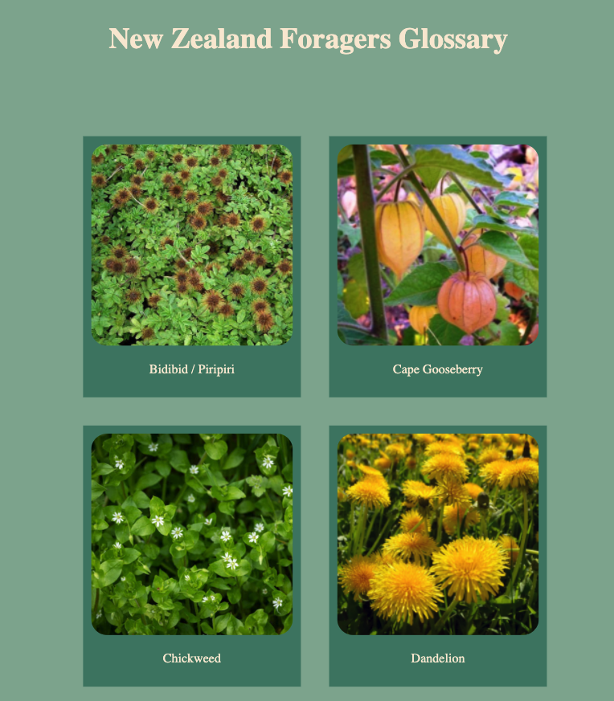
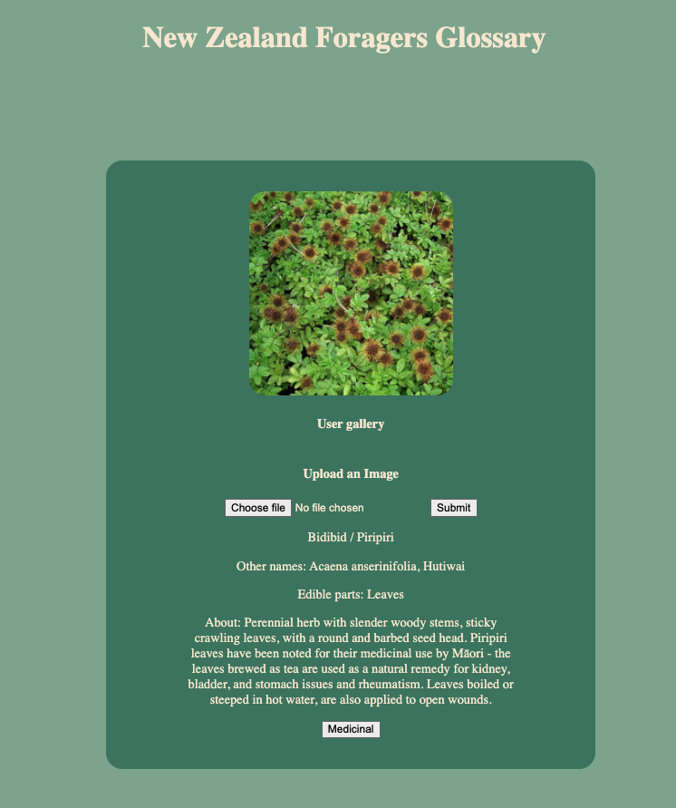

 </img>
 </img>

# NZ Forager 
My final project at Dev Academy, with a tech focus on developing a full stack web application using redux, react, node.js, and databases.

This application is for foragers in New Zealand who are interested in identifying plants for dyes, eating, or medicinal uses. The interface is designed to be very minimalist, with a simple tap/ click through to plant descriptions and user photos - user photos help ensure the certainty of identification for foragers, with many photos of plants from different angles and lighting. 

The descriptions include a guide around best uses, Maori history of use, as well as which parts of the plant are safe for consumption. 

The addition of a geo-map linked to plant tags in the database will help users find local foraging spots. Recipes will inspire ways of using the plants, and overall the app encourages resourcefulness and connection with plant use and history.

To do:
- Finish up CSS 
- JWT-Auth
- Display user cloud photo uploads in front end 
- Finish the add plant function
- Add an interactive location map
- Tags pages for uses (medicinal, edible, natural dyes, etc)
- Recipes for foods, natural dyes

